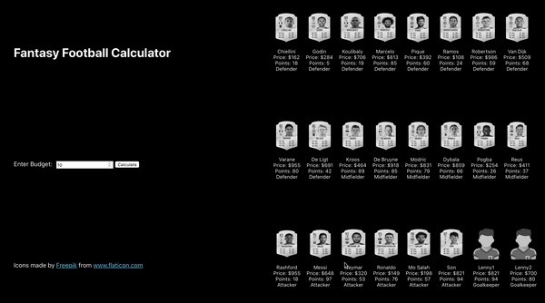

# Fantasy Football Calculator

A mini project to demonstrate Multidimensional 0-1 Knapsack Problem for SMU CS104

Given the budget for the entire team,
1. Choose strictly 11 players
2. Choose <= 4 defenders
3. Choose <= 5 midfielders
4. Choose <= 3 attackers
5. Choose <=1 Goalkeepers

## Running the project

In the project directory, you can run:

### `yarn start & yarn start-api`

Runs the app and the flask server in the development mode. 
Open [http://localhost:3000](http://localhost:3000) to view it in the browser.

The page will reload if you make edits. 
You will also see any lint errors in the console.

## Reference

Fantasy Football as a Data Scientist [Part 2] Knapsack Problem. (2020). Retrieved 12 October 2020, from https://medium.com/@kangeugine/fantasy-football-as-a-data-scientist-part-2-knapsack-problem-6b7083955e93 

Icons made by Freepik from www.flaticon.com 

Images obtained from https://www.futhead.com/21/players 

